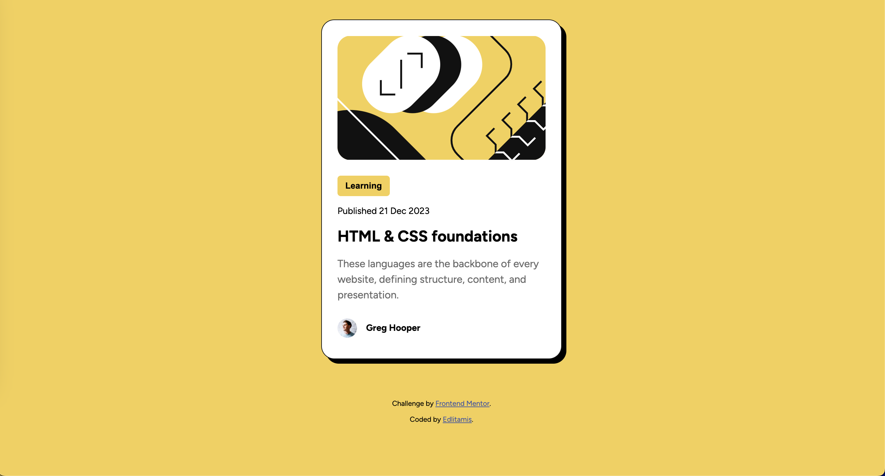
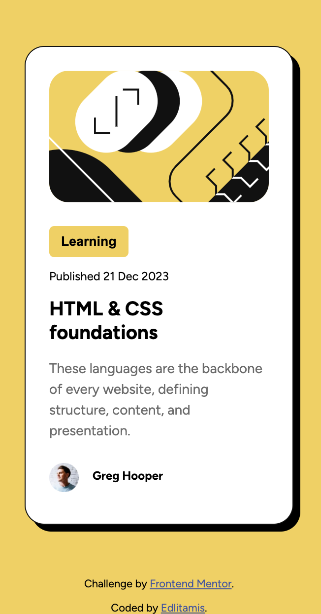

# Frontend Mentor - Blog preview card

This is a solution to the [ Blog preview card challenge on Frontend Mentor](https://www.frontendmentor.io/challenges/blog-preview-card-ckPaj01IcS).

## Table of contents

- [Screenshot](#screenshot)
- [Links](#links)
- [Built with](#built-with)

## Screenshots
### Desktop 

### Mobile

## Links

- Live Site URL: [https://edlitamis.github.io/blog-preview-card/](https://edlitamis.github.io/blog-preview-card/)

## Built with

- Semantic HTML5 markup
- CSS custom properties
- CSS media queries
- CSS animations pseudo-classes (`:active`, `:hover`)
